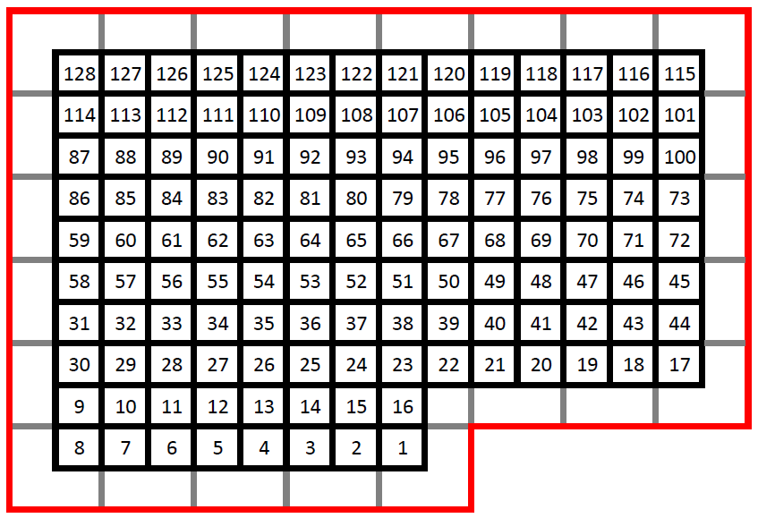

**Goals:** Let's add additional variables to our analyses. All new variables are saved in `Calculating additional variables.Rdata` and includes:

* d_quad_neighbors: rust intensity in the neighboring quadrants
* d_quad_rates: rust increase rate for the 2016 season

```{r}
library(tidyverse)
library(ggplot2)
library(DT) # For datatable()
source(file = "Functions/find_peakvalley.R")

roya = readRDS(file = "data/roya_uniqueplants_20210505.rds")
```


# Rust increase rate for the 2016 season

```{r summarize-all-quads}
d_roya_subset = roya %>%
  filter(year %in% c(2015, 2016, 2017)) %>%
  mutate(inf = ifelse(hojas == 0, NA, roya/hojas),
         month = ifelse(month < 10, paste("0", month, sep=""), month),
         time = paste(year, month, sep = "-")) %>%
  group_by(time, quadrat) %>%
  summarize(inf_avg = mean(inf, na.rm = TRUE),
            inf_total = sum(inf, na.rm = TRUE)) %>%
  as.data.frame()

# Fills in missing months
all_times = expand.grid(quadrat = c(1:128), year = c(2015:2017), month = c(1:12)) %>%
  mutate(month = ifelse(month < 10, paste("0", month, sep=""), month),
         time = paste(year, month, sep = "-")) %>%
  select(time, quadrat) %>%
  arrange(time)
d_roya_subset = all_times %>%
  left_join(d_roya_subset, by = c("time", "quadrat"))
```


## Overall 2016 rust season
```{r all-quad-dynamics}
d1 = d_roya_subset %>%
  group_by(time) %>%
  summarize(inf_avg = mean(inf_avg, na.rm = TRUE),
            inf_total = sum(inf_total, na.rm = TRUE))

#barplot(inf_avg ~ time, data = d1, las=3) # Looks very similar
barplot(inf_total ~ time, data = d1, las=3)
```

The rust cycle runs from May through May. Our abiotic variables were collected in Summer 2016, so perhaps we should try to predict the rate of increase in rust from May 2016 - May 2017.

Do individual quadrats vary much in this pattern?

```{r all-quad-indiv}
# Plots of individual quadrat; takes too long to run
# ggplot(data = d_roya_subset, aes(x = time, y = inf_total)) + 
#   geom_bar(stat = "identity", color = "blue", alpha = 0.2) +
#   facet_wrap(~quadrat)
```

Yes, there is a wide variation in each quadrat's trajectory. (Did not show graph because takes too long to generate in every knit.)

## Testing KL's functions

```{r practice-using-functions}
d_124 = d_roya_subset %>%
  filter(quadrat == 124)
  
trend = find_peakvalley(d_124, "inf_total", "time", 6)
trend2 = find_peakvalley(d_124, "inf_total", "time", 3) # Doesn't find all the correct peaks and valleys

datatable(trend)

barplot(inf_total ~ time, data = d_124, las = 3)
```

To-do: 

* Ask KL how max.offset works
* Go over change I made in the functions file (find_peakvalley.R)
    * Needed to add "last.date" on line 12

## Calculate rate of rust increase in 2016 season for each quadrat

```
{r calc-rates, include=FALSE, warning=FALSE}
# Used for calculating change in time for rates
timesteps = all_times %>% select(time) %>% unique()
timesteps = timesteps %>%
  arrange(time) %>%
  mutate(step = c(1:nrow(timesteps)))


# For each quadrat, find start and end dates of increase
d_quad_rates = data.frame()
for (quad in unique(d_roya_subset$quadrat)) {
  # Calculate all peaks and valleys between 2015-2017
  data = d_roya_subset %>% filter(quadrat == quad)
  all_peaks_valleys = find_peakvalley(data, "inf_total", "time", 6)
  
  # Find valley in 2016
  start_valley_date = all_peaks_valleys %>%
    filter(takeoff == TRUE, grepl("2016", date)) %>%
    pull(date) 
  # There might not be a start_valley_date in 2016, or not just one
  if(length(start_valley_date) != 1) {
    start_valley_date = NA
  }
  
  # Given run's start date, find run's end date
  end_peak_date = NA
  if(!is.na(start_valley_date)) {
    # Find all runs
    all_runs = find_runs(all_peaks_valleys)
    # Find targeted run
    run = all_runs %>% 
      filter(date == start_valley_date) %>%
      select(runID, runtype)
    # Look for end date of targeted run
    if (run$runtype == "growth") {
      end_peak_date = all_runs %>%
        filter(runID == runID) %>%
        slice_max(date) %>%
        pull(date)
    }
  }
  
  newrow = data.frame(quad = quad,
                      start = start_valley_date,
                      end = end_peak_date)
  # Calculate rust increase rate if quadrat has a run
  if(!is.na(newrow$start) && !is.na(newrow$end)) {
    newrow = newrow %>%
      mutate(inf_tot_i = data[data$time == start, "inf_total"],
             inf_tot_f = data[data$time == end, "inf_total"],
             t_i = timesteps[timesteps$time == start, "step"],
             t_f = timesteps[timesteps$time == end, "step"],
             rate = (inf_tot_f-inf_tot_i)/(t_f - t_i))
  } else {
    newrow = newrow %>%
      mutate(inf_tot_i = NA, inf_tot_f = NA, t_i = NA, t_f = NA, rate = NA)
  }
  
  # Add quadrat's data to results
  d_quad_rates = rbind(d_quad_rates, newrow)
}
save(d_quad_rates, file = "Calculating additional variables.Rdata")
```

Reducing max.offset leads to more missing values, so let's stick with max.offset = 6 for now.


```{r}
load(file = "Calculating additional variables.Rdata")

datatable(d_quad_rates)
```

Metadata

* quad = quad ID
* start = the starting month in 2016 of the infection increase
* end = the ending month of the infection increase, i.e., the peak of the infection for that season, which may be in 2017
* inf_tot_i = total infection level (proportion of infected leaves on all ~5 plants in the quadrat) at the start of the infection
* inf_tot_f = final infection level (proportion of infected leaves on all ~5 plants in the quadrat) at the end of the infection
* t_i = a numeric value for the month when the infection started
* t_f = a numeric value for the month when the infection ended
    * t_f - t_i = the number of months the infection increase took place over
* rate = the rate of increase in the total number of infected leaves for all ~5 plants in the quadrat; $\frac{inf_{tot,f}-inf_{tot,i}}{t_{f}-t_{i}}$

# Rust infection load of neighboring quadrats (July 2016)

## Map of quadrats


```
{r calc-neigh-rust}
quad_coord = read.csv("data/quad_coordinates.csv", stringsAsFactors = FALSE)
edge_quads = c(1:9, 30, 31, 58, 59, 86, 87, 114, 128:115, 101, 100, 73, 72, 45,
               44, 16:23)

### Compile information about each quadrat
# Type of quad: edge or in
d_quads_neighbors = quad_coord %>%
  mutate(type = ifelse(quad %in% edge_quads, "edge", "in"),
         neighbors = NA, n_neigh = NA)
# Number of neighbors for each quad
for (i in 1:nrow(d_quads_neighbors)) {
  quad_id = d_quads_neighbors[i, "quad"]
  quad_x = d_quads_neighbors[i, "x"]
  quad_y = d_quads_neighbors[i, "y"]
  neighbors = d_quads_neighbors %>%
    filter(x <= quad_x+1 & x >= quad_x-1 & y <= quad_y+1 & y >= quad_y-1,
           quad != quad_id) %>%
    pull(quad)
  d_quads_neighbors$neighbors[i] = list(neighbors)
  d_quads_neighbors$n_neigh[i] = length(neighbors)
}
# Average (per-quad) rust load of neighboring quadrats in July 2016
d_roya_2016_07 = d_roya_subset %>% filter(time == "2016-07")
d_quads_neighbors$inf_neigh = NA
for (i in 1:nrow(d_quads_neighbors)) {
  neighbors = d_quads_neighbors$neighbors[i][[1]]
  neighboring_infection = d_roya_2016_07 %>%
    filter(quadrat %in% neighbors) %>%
    summarize(inf = mean(inf_total, na.rm = TRUE)) %>% pull(inf)
  d_quads_neighbors[i,]$inf_neigh = neighboring_infection
}

save(d_quad_rates, d_quads_neighbors,
     file = "Calculating additional variables.Rdata")
```

There are 31 edge quadrats and 97 interior quadrats, with 5 corner quadrats that only have three neighbors. If we do a t-test comparing interior vs edge quadrats, there is no significant difference in the average neighbor's infection.

Neighbor is defined as the neighboring quadrat.

```{r}
# Loaded data file above

### Compare neighboring infection load of edge vs internior quadrats
t.test(d_quads_neighbors[d_quads_neighbors$type=="edge","inf_neigh"], 
       d_quads_neighbors[d_quads_neighbors$type=="in","inf_neigh"])

# ### Visualize plot
# ggplot(d_quads_neighbors, aes(x = x, y = y, label = quad)) +
#   geom_point(colour = "grey90") + geom_text()

datatable(d_quads_neighbors)
```

Metadata

* quad = quad ID
* x = x coordinate of quad
* y = y coordinate of quad
* type = edge or interior quad
* neighbors = quad ID of neighboring quads
* n_neigh = number of neighboring quads, varies depending on whether quad is an edge, order, or interior
* inf_neigh = average total infection of neighboring quads, where total infection is the proportion of leaves infected summed across all ~5 plants for that quad
